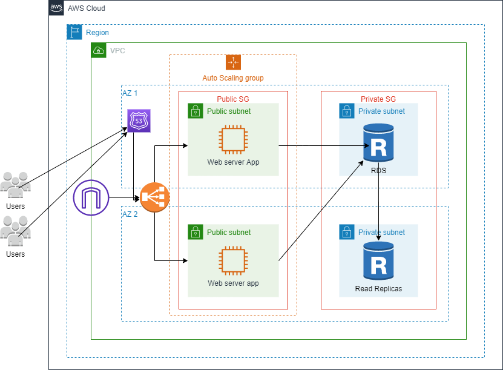

# Application Deployment using Terraform and Traditional Methods

# Architecture image



This guide outlines the steps to deploy a Node.js application on AWS using both Terraform and traditional provisioning methods.

## Terraform Deployment

### Prerequisites

- Install Terraform on your local machine.

```bash
# Terraform Installation
# Example for Linux
sudo apt-get update
sudo apt-get install terraform
```

### Deployment Steps

1. Clone the project repository.

```bash
git clone https://github.com/your/repository.git
cd repository
```

2. Navigate to the Terraform directory.

```bash
cd terraform
```

3. Initialize Terraform.

```bash
terraform init
```

4. Modify the `variables.tf` file with your AWS credentials and other necessary variables.

5. Review and apply the Terraform configuration.

```bash
terraform apply
```

6. Confirm by typing "yes" when prompted.

7. After deployment, note the output values for further configuration steps.

## Traditional Deployment

### Node.js Application Setup

1. Follow the Node.js Application Deployment Guide up to the "Install and Configure Nginx" section.

### Nginx Configuration for Load Balancer

1. Create an Nginx configuration file for your Node.js application.

```bash
sudo nano /etc/nginx/sites-available/MySQLApp
# Add configuration details (see above)

# Create symbolic link
sudo ln -s /etc/nginx/sites-available/MySQLApp /etc/nginx/sites-enabled

# Test Nginx configuration
sudo nginx -t

# Restart Nginx
sudo systemctl restart nginx
```

### AWS Deployment

1. Create an Amazon Machine Image (AMI) from the running instance provisioned traditionally.

2. Create a launch template with the AMI created.

3. Set up an auto-scaling group to manage the instances.

4. Create a target group and associate it with the auto-scaling group.

5. Configure a load balancer to distribute traffic among instances.

6. Copy the load balancer domain and test it in a browser to ensure traffic is directed to the instances.

## Notes

- Ensure proper security group settings for both Terraform and traditional provisioning.

- Periodically update and manage your infrastructure with Terraform commands (`terraform plan`, `terraform apply`, etc.).

- Monitor application and infrastructure health regularly.

By following these steps, you'll have a comprehensive deployment guide for your Node.js application using both Terraform and traditional provisioning methods.
